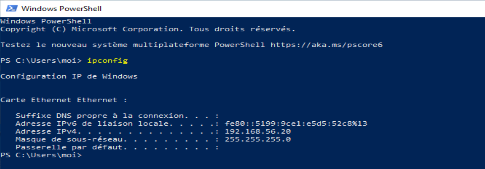
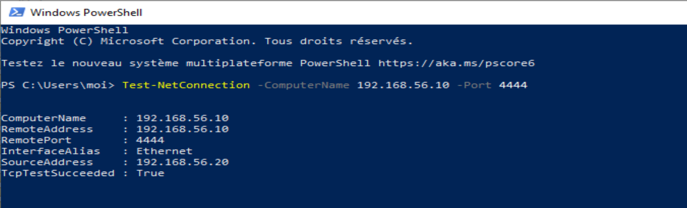
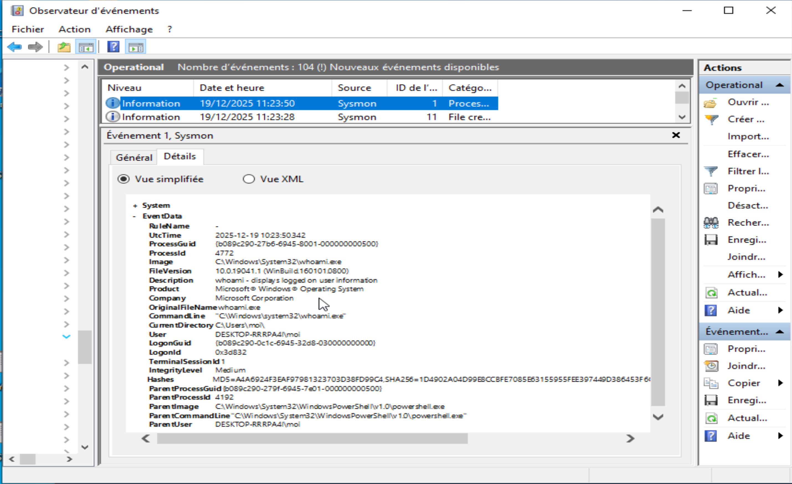

# Analysis Report

## Project Overview
This report details the technical implementation of a security monitoring laboratory. The goal was to establish a deep visibility baseline on a Windows endpoint using **Sysmon** and to validate this telemetry by simulating real-world attack techniques from a **Kali Linux** machine.


## 1. Infrastructure & Lab Setup

### Virtual Environment Configuration

The lab consists of two virtual machines isolated within a **VirtualBox Host-Only Network** to ensure a safe testing environment.

* **Attacker Node (Kali Linux):** Acts as the Command & Control (C2) server.
  
    * **IP Address:** `192.168.56.10`.
    * **Tooling:** Netcat (Network listener).
     
      
* **Victim Node (Windows 10):** The monitored endpoint.
  
    * **IP Address:** `192.168.56.20`.
    * **Tooling:** Sysmon64, PowerShell.
     


### Connectivity Validation
To confirm the communication channel, a connection test was initiated from Windows to the Kali listener on port **4444**. The success of this test confirmed that the virtual network was correctly routed.


---

## 2. Telemetry Deployment (Sysmon)

Before simulating the attack, **Sysmon64** was installed with a customized XML configuration to capture granular events. I verified the service status to ensure consistent logging.

```powershell
# Command used to check service status
Get-Service sysmon64
```

## 3. Attack Simulation & Detection Analysis

### Phase 1: Command & Control (C2) Callback

The first simulation involved creating a network callback from the victim to the attacker's machine.

* **Action:** Attacker listens on port 4444 (nc -lvnp 4444) and the victim connects.

* **Detection** (Event ID 3 - Network Connection): Sysmon successfully identified the outbound TCP connection.

* **Analysis:** The log precisely identifies the source process (powershell.exe), the destination IP (192.168.56.10), and the target port (4444).
  


### Phase 2: Host Reconnaissance

Once the "attacker" gained access, reconnaissance commands were executed to identify the current user context.

* **Action:** Execution of whoami.exe.

* **Detection** (Event ID 1 - Process Creation): Sysmon captured the execution detail.

* **Analysis:** Beyond just the command, the telemetry reveals the Parent-Child relationship. Seeing powershell.exe spawning whoami.exe is a high-fidelity indicator of a manual hack or a script-based discovery phase.
  


## 4. Conclusion & Key Takeaways

This laboratory demonstrates that:

* **Visibility is key:** Standard logs might miss the specific network connection initiated by PowerShell, but Sysmon Event ID 3 provides definitive proof.

* **Parent Process Analysis:** By monitoring Event ID 1, we can distinguish between legitimate system use and suspicious command-line activity initiated by a shell.

* **Proactive Defense:** Having this telemetry allows a SOC Analyst to build alerts based on suspicious ports (like 4444) or unusual parent-child process relationships.

## Files used in this project:

* Configuration: config/sysmonconfig-export.xml

* Evidences: EVIDENCE/ (Screenshots)

* Main Documentation: README.md


